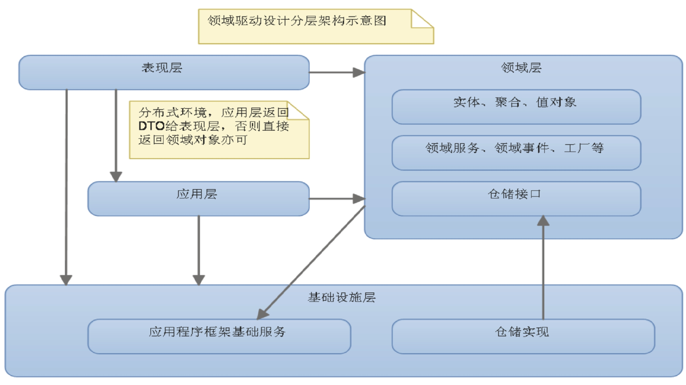
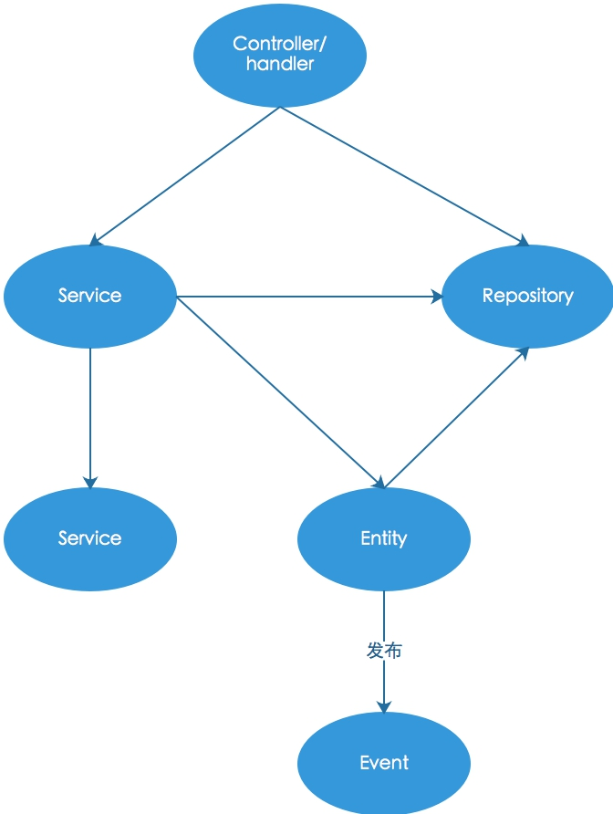

WecarSwoole
----
### 简介

WecarSwoole 是基于 EasySwoole 开发的适用于喂车业务系统的 Web 开发框架。

[EasySwoole 使用说明](http://www.easyswoole.com)


### 环境要求

- PHP >= 7.2

- Swoole >= 4.3.0

- phpredis 扩展

  > php.ini 配置文件需加入 `redis.pconnect.pooling_enabled=1` 开启 phpredis 连接池


### 创建新项目

1. 创建项目目录 myproject;

2. cd myproject 并创建 `composer.json`，加入以下代码：

   ```json
   {
       "name": "wechar/wecarswoole_proj",
       "description": "your project name",
       "type": "project",
       "require": {
           "framework/wecarswoole": "dev-master"
       },
       "repositories": {
           "0": {
               "type": "vcs",
               "url": "https://gitlab4.weicheche.cn/framework/wecarswoole.git"
           },
           "1": {
               "type": "vcs",
               "url": "https://gitlab4.weicheche.cn/dev/locker.git"
           },
           "2": {
               "type": "vcs",
               "url": "https://gitlab4.weicheche.cn/dev/mysql.git"
           },
           "3": {
               "type": "vcs",
               "url": "https://gitlab4.weicheche.cn/framework/wecar_easyswoole.git"
           },
           "4": {
               "type": "vcs",
               "url": "https://gitlab4.weicheche.cn/framework/easyswoole_http.git"
           },
           "packagist": {
               "type": "composer",
               "url": "https://packagist.laravel-china.org"
           }
       }
   }
   ```

3. 执行 `composer install`
4. 执行 `php vendor/bin/wecarswoole install` 安装 WecarSwoole 框架
5. 启动：`php easyswoole start d --env=dev` (—env : dev、test、preview、produce，d 表示后台运行)
6. 停止：`php easyswoole stop`
7. 其他指令参见 easyswoole 官网

**注意**

> 1. 由于我们目前没有私有 composer 仓库，故上面的配置文件采用 vcs 仓储模式加载组件，包括以后开发的新组建也要将 gitlab 地址加入到这里面（必须加入到项目的 composer.json 中，加入到下级组件的 composer.json 是无效的）；
>
> 2. 当搭建了私有 composer 仓库后，可以删掉这些 `vcs`  配置，只需将 `packagist` 项改成我们自己的私有仓库地址即可；
> 3. 由于对 EasySwoole 框架做了修改（增加依赖注入能力），故使用我们内部的克隆版；
> 4. 当执行 composer 命令出错时（如 install、update 等），请在后面加 -vvv 查看详细信息（如 composer install -vvv）；
> 5. 项目不要提交 vendor 目录到 git 中；
> 6. 关于国内镜像： https://packagist.phpcomposer.com 没人维护了，现在用了 https://packagist.laravel-china.org，虽然 Laravel China 声称会长期维护，不过不可保证，可考虑搭建内部 composer 库；


### 在现有项目上开发

- 根据前面步骤创建项目并提交后，其他人 clone 下来执行 `composer install` 即可。
- 生产环境部署：部署平台（如 walle）需要增加指令：`composer install`，该指令会根据 composer.lock 文件信息安装指定版本的库。
- **不要在生产环境执行 `composer update`！**
- **不要每个开发人员随便在本地执行 `composer update`！**
- 一句话：**谨慎执行 `composer update`**，因为 composer update 指令会根据 composer.json 中的版本配置信息获取符合版本约束的最新代码并更新 composer.lock 文件，如果每个开发人员都去执行 composer update，那么 composer.lock 文件会频繁变动，造成不稳定，可能会出现莫名其妙的问题。


### 给项目引入新的包

1. 团队中某个成员在项目根目录下执行：`composer require vendor/package_name`，如 `composer require monolog/monolog ` ；
2. 提交到 gitlab；
3. 其他人 `git pull --rebase` 并执行 `composer install` 安装新的包；
4. 开发完成，发布；


### 更新包文件

1. 团队中某个成员在项目根目录下执行 `composer update vendor/package_name`，如 `composer update framework/wecarswoole`；
2. 提交到 gitlab；
3. 其他人 `git pull --rebase` 并执行 `composer install` 安装新的包；
4. 开发完成，发布；

> 注意：不要执行 `composer update` 一次更新所有包，要更新哪个就更新哪个。


### 语义化版本控制

使用 composer 做依赖管理时（包括我们自己开发 composer 包），需要遵循语义化版本控制：

版本格式：**主版本号.次版本号.修订号**，版本号递增规则如下：

1. **主版本号**：当你做了**不兼容**的 API 修改；
2. **次版本号**：当你做了**向下兼容的功能性新增**；
3. **修订号**：当你做了**向下兼容的问题修正**；

更多信息请参见 [语义化版本控制](https://semver.org/lang/zh-CN/)

> 即是说，我们的包向外只是发布之后，不能随便修改其内容，一旦修改，就需要同时增加新的版本号（打 tag），版本号命名需遵循以上约束。


以上几点是 composer 的常见使用方式，大家记住最重要的一点：**谨慎执行任何导致 composer.lock 文件发生变化的操作指令（如update，require 等）**，因为一旦 composer.lock 发生变化并发布生产，生产环境将应用这些变化。


### 系统设计要点

- 可扩展性
- 容易和第三方系统对接
- 可测试
- 遵循 PSR 规范


### 目录结构

- project_root
  - app
    - Cron
    - Domain
      - Events
    - Exceptions
    - Foundation
      - Repository
      - Util
    - Http
      - Controllers
        - V1
          - $modules
      - Middlewares
      - Routes
    - Process
    - Subscribers
    - Tasks
  - config
    - api
    - di
    - env
    - subscriber
  - storage
    - app
    - cache
    - di
    - logs
    - temp
  - vendor
  - tests

#### 说明

app/ : 项目代码目录

app/Cron/ : 定时任务

app/Domain/ : 业务（领域）逻辑，核心目录

app/Domain/Events/ : 领域事件

app/Exceptions/ : 异常类定义

app/Foundation/ : 基础设施（如仓储实现类等）

app/Foundation/Repository/: 仓储实现

app/Foundation/Util/: 工具

app/Http/ : http 路由、控制器，对外暴露 http api

app/Http/Controllers/: http 控制器

app/Http/Controllers/V1/: 版本

app/Http/Controllers/V1/$modules/: 模块划分（模块名具体而定）

app/Http/Middlewares/: 中间件（如路由中间件）

app/Http/Routes/: 路由定义

app/Process/ : 自定义进程

app/Subscribers/ : 事件订阅者

app/Tasks/ : 异步任务

config/ : 配置文件

config/api/ : 外部 api 定义

config/di/ : 依赖注入配置

config/env/ : 环境相关配置（如数据库、redis 等）

config/subscriber/ : 订阅者配置

storage/ : 存储相关（日志、缓存、临时文件等）

storage/app/ : 应用程序存储（如第三方证书等）

storage/cache/ : 文件缓存

storage/di/ : di 缓存

storage/logs/ : 文件日志

storage/temp/ : 临时文件

vendor/ : 第三方库

tests/ : 单元测试

dev.php : 开发环境（包括开发、测试、预发布）swoole_server 配置

produce.php : 生产环境 swoole_server 配置

easyswoole : 服务启动/停止/重启脚本

EasySwooleEvent.php : 全局事件


> 注：以上目录划分确定了基本的开发规范，但实际开发过程中并不限制一定只能划分以上目录，各项目可以在此基础上根据实际需要开设额外的目录。


### 设计思想

- 借鉴于**领域驱动设计(DDD)**思想。有别于传统 MVC 分层设计，在 DDD 中，系统划分为四个层次：

  - **表示层**。展示UI/数据、接收用户的输入，直接和用户打交道（用户可能是人也可能是其他系统）。如前端交互。
  - **应用层**。从用户的维度定义系统需要完成的**任务**。应用层只定义任务，不负责具体实现。如这里的 Controller、Cron（实际上它们也承担了部分表示层职责）、Task、Subscriber等。
  - **领域层**。业务逻辑的具体实现。应用层调用领域层实现具体的任务。这里的 Domain目录下的代码。
  - **基础设施层**。提供诸如 DB、Cache、SESSION、Email、Log 等业务无关的基础支持。

  [领域驱动设计](https://www.jdon.com/ddd.html)

  [领域驱动设计分层模型](https://www.jianshu.com/p/c405aa19a049)




### 框架中的分层说明

- **表示层 + 应用层**：框架并没有对表示层和应用层做严格的划分，后面提到**应用层**也是指部分表示层+应用层。严格来说，表示层诸如 web（h5、json等）、web socket等客户端需要的数据格式以及提供的输入由表示层作转换处理，然后交由应用层，且多个表示层可以共用同一个应用层。我们的框架中路由+Controller 完成表示层+应用层的工作（不光如此，其他类型的 handle 如事件订阅者也兼顾表示层和应用层的工作）。框架处于复杂性考虑没有引入应用服务的概念，不过熟悉 DDD 的话根据实际需要可以自行引入。

  框架中的应用层：

  - Cron/：定时任务；
  - Http/: http api (路由、控制器)；
  - Subscribers/: 事件订阅者；
  - Tasks/: 异步任务；

  应用层应当尽可能简单，不能写业务逻辑（业务逻辑要写在 Domain 中），主要是用来定义用例维度的**任务**（如用户注册）。

- **领域层**。放在 Domain/ 目录中。这里放具体的业务逻辑代码，属于系统核心。Domain/ 底下可根据实际需要自由创建目录，自由组织代码。不过根据 DDD 通行做法，会分成以下几大概念：

  - Service（服务)。全称是**领域服务**(相对于应用服务)。Service 是用来组织其他实体类或其他 Service 实现业务逻辑的。外界（如 Controller）一般调用 Service 完成任务。Service 应当保持简单（即自己不实现业务细节，而是通过调用、组织其他类来实现功能），而且是**无状态的**（即 Service 不能在属性中保存业务状态信息）。

    另一个常见的 Service 是外部接口调用，如调用外部的积分系统，此时一般我们会创建一个单独的 Service 封装接口调用。

  - Entity（实体)。Entity 对应业务中的"那一个"东西，一般在数据库有对应一条记录。Entity 有唯一标识。

  - Value Object(值对象)。和 Entity 不同，Value Object 不区分"那一个"，Entity 通过标识辨识，而 Value Object 通过属性辨识。

  - Aggregation（聚合）。一个或多个 Entity 集聚成一个 Aggregation。外界跟 Aggregation 打交道，而不是直接跟每个 Entity 打交道。聚合有聚合根（Aggregation Root），它是一个 Entity。很多时候，一个 Entity 就是一个 Aggregation。

  - Domain Event（领域事件）。在领域对象中触发的事件。一般我们采用事件来接耦非主流业务，保持主流程的清晰简洁。

  - Repository（仓储）。实现 Entity 的存取。仓储是领域模型和数据存储（基础设施）之间的桥梁，它知晓领域类的细节以及数据存储的细节。一般地，在 Domain/ 中定义 Repository 接口，而在基础设施中定义实现，然后通过依赖注入来使用。仓储也应该是**无状态**的。

  - **领域层**简化版：

    不熟悉 DDD 甚至是面向对象设计的话，上面的概念会难以理解，实际操作中可以作如下简化：

    - Service（服务）。同上。服务主要起协调、组合的作用，其本身不应提供具体的业务实现；
    - Entity（实体）。我们将上面的 Entity、Value Object、Aggregation 不做区分统一看作 实体。每个实体类都不大，负责的功能比较单一，多个实体组合/聚合完成一项完整的功能。总之，你可以把这里的实体看作类似之前的 Logic，不过是进行了职责划分的多个类的有机组合；
    - Domain Event（领域事件）。相当于钩子，采用的是观察者模式，实现复杂业务解耦；
    - Repository（仓储）。同上。

  - 注意：

    - 领域层的代码应当是可测试的（单元测试）；
    - 领域层对其他层的依赖应当通过依赖注入实现，而不能在领域层直接 new 其他层的对象；
    - 领域层和其他层通信一般是基于接口的（面向接口编程）；
    - 不要在领域层直接使用 Session、Request、Response、Cookie、Header、Container、DI、Config 等全局变量和框架相关的东西，保证业务逻辑代码是框架无关的而且是可测试的；

- **基础设施层**。提供诸如 DB、Cache、SESSION 等业务无关的基础支持。


### 调用关系图解




##### 说明

- 应用层的控制器/处理器调用领域层的 Service 处理任务；
- 应用层的控制器/处理器调用仓储 Repository 直接查询数据（针对那种不需要业务逻辑处理的数据展示，我们可以在控制器中直接调用仓储，返回需要的 DTO 对象，此乃**用例查询优化**）；
- Service 可以调用另一个 Service；
- Service 可以调用实体 Entity 来实现功能；
- Service 可以调用仓储获得 Entity；
- Entity 可以调用其它 Entity；
- Entity 可以调用 Service；
- Entity 可以发布事件供外围程序处理；


### 使用详解

----

#### Http 路由

- 系统对外暴露的所有接口都要进行显式的路由定义；

- 定义文件：app/Http/Routes/ 中定义，如 User.php 定义用户相关路由；

- 路由类需继承 `WecarSwoole\Http\Route` 抽象类并实现 map() 方法定义具体路由，使用 get、post、put、delete 定义 Restful API 接口；

  例：

  ```php
  namespace App\Http\Routes;
  
  use App\Foundation\Http\Route;
  
  class Users extends Route
  {
      public function map()
      {
          // 添加用户
          $this->post('/v1/users', '/V1/Users/add');
          // 用户-商户关系绑定
          $this->post('/v1/merchants/{merchant}/users/{uid}', '/V1/MerchantUsers/bind');
          // 修改用户信息
          $this->put('/v1/users/{uid}', '/V1/Users/edit');
          // 查询用户信息
          $this->get('/v1/users/{uid}', '/V1/Users/info');
          // 查询商户-用户列表
          $this->get('/v1/merchants/{merchant}/users', '/V1/MerchantUsers/getUsers');
          // 合并用户
          $this->post('/v1/users/merge', '/V1/Merge/mergeUsers');
          $this->delete('/v1/users/{uid}', 'V1/Users/delete');
      }
  }
  ```

#### 路由中间件

可以添加中间件进行路由信息拦截，如用来做鉴权（api鉴权、登录验证等）。如果中间件抛出异常，则终止请求执行，返回错误给用户。

- 在 app/Http/Middlewares/ 中创建中间件类，需实现 `\WecarSwoole\Middleware\IRouteMiddleware` 接口（并实现其 `handle(Request $request, Response $response)` 方法）;
- 在路由类的构造函数中调用 `$this->setMiddleware(array $middlewareNameList)` 给路由添加中间件，参数为中间件类名。该做法会让该路由类以及继承该路由类的路由全部应用该中间件；
- 还可以针对单独的路由添加中间件：在调用 get、post、put、delete 方法设置路由时第三个参数可以传入中间件列表，格式同上；

实践：设置两个路由指向同一个控制器，这两个路由一个暴露给公司内部，一个暴露给外部第三方，两者使用不同的鉴权机制，而实现的功能相同（因而使用同一个控制器）。可以创建两个路由父类，两者使用不同的鉴权中间件，一个对内，一个对外，所有内部 api 都继承对内的那个父类，对外 api 则继承另一个。

> 注意：不要在路由中间件中修改 $request 的数据结构，因为多个路由可能指向同一个控制器，如果在路由中修改请求数据结构，会导致同一个控制器从不同的路由接收到的数据结构不一致，导致潜在问题。

#### Restful API

建议使用 Restful 风格 api 定义。关于 Restful 请参见 [Restful API 最佳实践](http://www.ruanyifeng.com/blog/2018/10/restful-api-best-practices.html)


#### 控制器

严格来说叫 Http 控制器。目录：`app/Http/Controllers/$version`。

控制器属于**处理器**的一种，属于应用层程序，因而控制器中不能写业务逻辑，通过调用 Domain 层实现业务处理。

- 所有的控制器需继承 `WecarSwoole\Http\Controller`；
- 控制器中除了对外暴露的接口，不要写 public 方法；
- **控制器中禁止写 private 属性，必须为 protected 的**。因为框架使用了对象池技术，每次请求结束后的清理程序无法清理 private 属性，从而 priate 属性值会保留到后面的请求，从而造成污染；
- 禁止在基类控制器对外暴露 api。基类控制器要保持尽可能简单；
- 禁止在控制器中使用静态属性（静态属性不会在每次请求后重置，会造成数据混乱）；
- 构造器中一定要在最后（而不是前面）再调用 parent::__construct()，否则后续请求无法访问这里面设置的属性；
- 建议使用依赖注入从控制器的构造函数注入 Service、Repository 等。
- 注意：通过依赖注入注入的依赖仅仅会创建一次，由于使用了对象池技术，后续会复用这些对象。因而，**依赖注入并赋值给控制器属性的对象必须是无状态的（如仓储、服务等）**，否则会造成混乱。
- 控制器是有版本控制的，但 Domain 没有，Domain 一般需要保持业务一致性。
- 目前的基类控制器提供的便捷方法：
  - `$this->params($key = null)`：获取输入参数，不分请求方式（POST、GET 等）；
  - `$this->container()`：获取符合 PSR 规范的 IoC 容器；
  - `$this->return($data = [], int $status = 200, string $msg = '')`：返回 json 数据；

对于命令类操作（需要修改数据的，涉及到业务逻辑的），一般是在控制器中注入并使用 Domain Service，对于查询类操作（仅获取数据用于展示，不涉及到多少业务逻辑处理的），一般可以在控制器中注入并使用 Repository，Repository 返回 DTO 对象，控制器中将 DTO 对象转成数组并格式化成 json 返回。

> 注：不建议在控制器中进行鉴权（如 api 鉴权、登录验证等），因为这样的话控制器就只能局限于当前鉴权上下文使用（如只能在用户登录状态下使用）。建议将鉴权操作前置到路由层（通过路有中间件实现，这点同 Laravel），路由层如果鉴权通过后，将必要信息追加到请求参数中传递给控制器。


#### 领域

##### 领域事件

可以在领域对象（领域服务、实体）中发布领域事件，实现观察者模式解耦非核心业务逻辑。

- 定义事件类：在 app/Domain/Events/ 中定义，需继承 `Symfony\Contracts\EventDispatcher\Event`，如：

  ```php
  namespace App\Domain\Events;
  
  use App\Domain\User\User;
  use Symfony\Contracts\EventDispatcher\Event;
  
  class UserAddedEvent extends Event
  {
      private $user;
  
      public function __construct(User $user)
      {
          $this->user = $user;
      }
  
      public function getUser(): User
      {
          return $this->user;
      }
  }
  ```

- 发布事件：

  - 依赖注入 `Psr\EventDispatcher\EventDispatcherInterface` （已经在 config/di/di.php 中配置其实现）；
  - `$dispatcher->dispatch(new YourEvent(​...$params));`；

- 订阅事件：

  - 定义：在 app/Subscribers/ 目录中定义，需实现 `Symfony\Component\EventDispatcher\EventSubscriberInterface` 接口并实现 `getSubscribedEvents()` 方法，如：

    ```php
    public static function getSubscribedEvents()
    {
      return [
        UserAddedEvent::class => [
          ['initLevel'],
          ['initCard']
        ]
      ];
    }
    
    public function initLevel(UserAddedEvent $event)
    {
      echo "初始化用户等级。用户:" . $event->getUser()->getId() ."\n";
    }
    
    public function initCard(UserAddedEvent $event)
    {
      echo "初始化用户储值卡。用户:" . $event->getUser()->getId() ."\n";
    }
    ```

注意：订阅者和控制器一样，属于**处理程序**，里面不应该写业务逻辑（业务逻辑还是要调 Domain/下面的类）。

##### 仓储

仓储是领域对象（实体）和存储设施（如 MySQL 数据库）之间的桥梁，它知道两方面内容：领域对象属性细节和存储细节。

行业实践上，分成仓储接口和仓储实现，在 Domain/ 中定义仓储接口（如 `IUserRepository`），在 Foundation/Repository/ 中定义具体实现（如 `MySQLUserRepository`）。Domain/ 中只依赖于接口，不依赖实现，这样好处是后面可以随意更改实现（如换成 MongoDB）。

框架默认使用的是 MySQL 实现，在 `config/di.php` 中定义：   `'App\Domain\*\I*Repository' => \DI\create('\App\Foundation\Repository\*\MySQL*Repository')`，这里要求接口所在的目录结构和Foundation/Repository/ 目录结构一致，且命名需符合规范（将 I 替换成 MySQL，其它不变）。如果需要更改实现，需在此处配置（注意放到这条之前，否则不会用到。具体参见 [PHP-DI](http://php-di.org)）。

- 仓储接口定义：一般直接放在 app/Domain/$module/ 下面（对于复杂的模块也可以定义专门子目录）：

  ```php
  interface IUserRepository
  {
      /**
       * 添加用户
       * @param User $user
       * @return int|bool 成功返回 uid，失败返回 false
       */
      public function add(User $user);
  
      /**
       * 根据 uid 获取用户
       * @param int $uid
       * @return User
       */
      public function getById(int $uid): ?User;
  }
  ```

- 仓储实现：一般放在 app/Foundation/Repository/$module/ 下面（对应上面的目录结构）：

  ```php
  class MySQLUserRepository extends MySQLRepository implements IUserRepository
  {
      /**
       * 添加用户
       * @param User $user
       * @return int|bool 成功返回 uid，失败返回 false
       */
      public function add(User $user)
      {
          $this->query->insert('users')->values([
              [
                  'name' => $user->name,
                  'phone' => $user->phone,
                  'nickname' => $user->nickname,
              ]
          ])->execute();
  
          return $this->query->lastInsertId();
      }
  
      /**
       * 根据 uid 获取用户
       * @param int $uid
       * @return User
       * @throws \App\Exceptions\PropertyNotFoundException
       * @throws \App\Exceptions\InvalidOperationException
       */
      public function getById(int $uid): ?User
      {
          $userInfo = $this->query->select('*')->from('users')->where(['uid' => $uid])->one();
  
          if ($userInfo) {
              $user = new User($userInfo['phone'], $userInfo['name'], $userInfo['nickname']);
              $user->setId($userInfo['uid']);
              return $user;
          }
  
          return null;
      }
  }
  ```

- 仓储方法入参可接收类型：Entity 类型、基本数据类型；
- 仓储方法返回参数：Entity 类型、基本数据类型、DTO；

> 注：为何要分开仓储接口定义和仓储实现？
>
> 仓储的实现更多的涉及到基础设施层的东西（数据库等），故放在基础设施层；仓储接口的定义更关注输入输出，而这些跟领域密切相关，故放在领域层。这种用法是 DDD 推荐的方式，也是业界通行做法。
>
> 领域层仅仅依赖于仓储接口，不依赖于实现，这样我们可以调整实现而不影响领域层代码，比如我们可以调整依赖注入配置，将实现从 MySQL 改成 MongoDB，或者我们可以重构数据库结构，这些影响的都仅仅是仓储实现部分的代码。


#### 定时任务

同 linux 的 Crontab。定时任务需要依赖 Redis（实现在分布式情况下仅有一台开启定时任务）。

- 类创建。在 app/Cron/ 下面创建定时任务处理程序类：

  ```php
  namespace App\Cron;
  
  use EasySwoole\EasySwoole\Crontab\AbstractCronTask;
  
  class Test extends AbstractCronTask
  {
      public static function getRule(): string
      {
          return '*/1 * * * *';
      }
  
      public static function getTaskName(): string
      {
          return 'test cron';
      }
  
      static function run(\swoole_server $server, int $taskId, int $fromWorkerId, $flags = null)
      {
          echo "test cron run logic\n";
      }
  }
  ```

- 在 config/cron.php 中配置：

  ```php
  return [
      // 定时任务项目名，同名的多台服务器只会有一台启动定时任务，请务必给不同项目起不同的名字，否则会相互影响
      'name' => 'user-center-platform',
      // crontab 需要 redis
      'redis' => 'main',
      'tasks' => [
          \App\Cron\Test::class
      ]
  ];
  ```

> 注意：定时任务同 Controller 一样也是**处理程序**，不能在里面直接写业务逻辑，业务逻辑同样需要在 Domain/ 中实现。


####异步任务

一些耗时的操作可以用异步任务后台处理。

-  定义：在 app/Tasks/ 下定义：

  ```php
  namespace App\Tasks;
  
  use App\Foundation\Mailer;
  use EasySwoole\EasySwoole\Swoole\Task\AbstractAsyncTask;
  
  /**
   * 邮件发送异步任务
   * Class SendMail
   * @package App\Tasks
   */
  class SendMail extends AbstractAsyncTask
  {
      /**
       * @param array $taskData 数据：['host' => '', 'username' => '', 'password' => '', 	   'message'=> $object],其中 message 为 \Swift_Message类型，必填，其它选填
       * @param $taskId
       * @param $fromWorkerId
       * @param null $flags
       * @return mixed
       * @throws \Exception
       */
      protected function run($taskData, $taskId, $fromWorkerId, $flags = null)
      {
          if (!$taskData['message'] || !$taskData['message'] instanceof \Swift_Message) {
              throw new \Exception("邮件内容非法，必须为 \Swift_Message 类型");
          }
          $mailer = Mailer::getSwiftMailer($taskData['host'] ?? '', $taskData['username'] ?? '', $taskData['password'] ?? '');
          return $mailer->send($taskData['message']);
      }
  
      protected function finish($result, $task_id)
      {
          // nothing
      }
  }
  ```

- 投递：

  ```php
  use EasySwoole\EasySwoole\Swoole\Task\TaskManager;
  ...
  TaskManager::async(new SendMail([...]));
  ```


#### 外部 API 调用

- 配置 Server。在 config/env/$env.php 中定义：

  ```php
  return [
      'server' => [
          'OL' => [
              'name' => '油号',
              'servers' => [
                  ['url' => 'http://192.168.85.201:8081', 'weight' => 100],
              ],
          ],
      ]
  ];
  ```

- 配置 api。在 config/api/ 中定义。如：

  api.php:

  ```php
  return [
      // 默认配置，如签名器、加密算法、数据格式等配置，这些配置都可以在各自 api 配置中覆盖（其中某些配置仅 http 协议适用）
      'config' => [
          // 请求协议
          'protocol' => 'http', // 支持的协议：http、rpc（尚未实现）
          // 当前项目 app_id
          'app_id' => 17200,
          // http 协议请求默认配置
          'http' => [
              // 服务器地址解析器，必须是 IHttpServerParser 类型
              'server_parser' => \App\Foundation\Client\Http\Component\DefaultHttpServerParser::class,
              // 请求参数组装器
              'request_assembler' => \App\Foundation\Client\Http\Component\DefaultHttpRequestAssembler::class,
              // 响应参数解析器
              'response_parser' => \App\Foundation\Client\Http\Component\JsonResponseParser::class,
              // 请求发送前的拦截器(尚未实现)
              'before_handle' => [],
              // 收到响应后的拦截器（尚未实现）
              'after_handle' => [],
              // https ssl 相关配置
              'ssl' => [
                  // CA 文件路径
                  'cafile' => '',
                  // 是否验证服务器端证书
                  'ssl_verify_peer' => false,
                  // 是否允许自签名证书
                  'ssl_allow_self_signed' => true
              ]
          ],
      ],
      // 组
      'wc' => include __DIR__ . '/weicheche.php',
  ];
  ```

  weicheche.php:

  ```php
  return [
      // 组公共配置，可覆盖 api.php 中的公共配置
      'config' => [
          'http' => [
  
          ]
      ],
      // api 定义
      'api' => [
          'user.coupon.info' => [
              'desc' => '获取用户券信息',
              'server' => 'CP',// 可以是简写的，也可以是完整写法如 https://coupon.weicheche.cn,也可以是数组(从中取一个)
              // path 的格式支持占位符，如 users/{uid}，group/{?group_id} (?表示可选)，使用时根据传参替换
              'path' => '/usercoupons/getUserCoupons',
              'method' => 'POST', // http 协议下，请求方式
              'protocol' => 'http',
          ],
          'merchant.users.list' => [
              'desc' => '获取商户用户列表',
              'server' => 'UC',
              'path' => '/v1/merchants/{merchant}/users',
              'method' => 'GET',
          ],
          'users.add' => [
              'desc' => '添加用户',
              'server' => 'http://localhost:9501',
              'path' => '/v1/users',
              'method' => 'GET',
          ]
      ]
  ];
  ```

- 调用：

  ```php
  use WecarSwoole\Client\Client;
  ...
  $result = Client::call('wc:users.add', $reqData);
  var_export($result->getBody());
  ```

- Client 目前仅支持 http 协议，但是可扩展的（比如支持 RPC 协议），api 具体用的什么协议是在配置文件中配置的，调用的时候不用管。
- 支持针对不同的分组或者单个 api 配置不同的请求参数组装器和响应参数解析器，者对于和第三方合作是很有用的，比如我们可以针对不同的第三方配置不同的分组，这些分组有各自的组装器和解析器实现。
- 系统对自身的 api 调用也需要在此处配置。
- 有待实现：
  - 请求前后拦截器；
  - 请求重试机制；
  - 支持异步（task）调用；

> 注：实际使用中，一般会将对外部系统的调用封装成服务类（Service），服务类调用具体接口并返回相应的数据（基本数据类型或者自定义类型）。


### 框架中用到的一些组件

- **Cache**: EasySwoole 没有提供缓存组件，项目使用 symfony/cache 的 PSR-16 规范的 SimpleCache。

- **Redis**: 项目没有使用 EasySwoole 的 RedisPool，而是使用 phpredis 扩展自带的连接池。
    
    php.ini配置：
    extension=redis.so
    redis.pconnect.pooling_enabled=1 
    
- **Http Client**: EasySwoole 自带的 http client 仅支持 get 和 post 请求，无法满足需求，故使用第三方库 swlib/saber （且在此基础上封装了 Client 统一使用模式）。

- **异常处理机制**：遵循业界最主流的做法：抛出异常，而不是返回错误码。（遵循业务逻辑和错误处理分离原则）。

- **依赖注入**：使用 [PHP-DI](http://php-di.org/doc/getting-started.html)
  附：[依赖注入最佳实践](http://php-di.org/doc/best-practices.html)
  
    - 在控制器中使用注解注入依赖；
    - 其它类（如 Service）使用构造函数注入依赖（保证可重用性和可测试性）；
    - 不要在程序中使用 $container->get(...)，造成程序对容器对依赖；
    - 推荐使用接口类型提示，在 config 中配置接口对应的实现；
      （生产环境需要开启编译，每次发版的时候要重新编译，建议采用预编译），开发环境关闭编译
      不会编构造函数注入的和注解注入的，如果要优化这些，需要开启 cache(需要apcu扩展)
  
- **日志**：使用 monolog/monolog。不使用 easyswoole 自带的 Logger（不符合 PSR 规范，没有日志级别控制等）。日志记录是异步的。

- **email**: 使用 SwiftMail 扩展。发送邮件是异步的。

- **事件**：使用 symfony/event-dispatcher 扩展。[参考](https://symfony.com/doc/current/components/event_dispatcher.html)


### 其它

##### 缺失的 Model

由于 Model 的具体含义有分歧，容易被乱用，实际中大部分时候被用作 ORM 和 DTO，并非真正意义上的"对象"（起的是数据结构作用），因而我们并没有引入 Model 的概念，而是引入 DDD 设计中的**仓储**概念。

##### 缺失的 Logic

Logic 一词同样含义模糊（一切皆逻辑），而且实际使用中过于扁平化，导致代码过于臃肿。取而代之，我们引入更加具有含义、更具纵深、更加灵活的 DDD 中的**Domain**概念（业务领域），让开发者根据实际情况自己组织代码层次。

##### 为何 Http/Controllers 下面有 V1 这样的版本划分？

Http/Controller 是系统最主要的对外 API，API 一旦定义则很难做不兼容修改（比如改个字段名，删掉某字段，改变字段含义等），因而可以采用版本控制，对外提供不同版本的 API(这也是为何 Restful API 的 uri 中包含版本的原因)。
不同于 API，Domain 不需要版本概念，因为 Web 产品一般只会演化而不会分版本（可能会划分新模块）。当然，会有定制化需求，可以采用其他方案处理。

##### 框架

一般不要用 easyswoole stop force，从其实现来看，会造成僵尸进程。

##### 工厂

- MySQL、Redis、Email、Cache、Logger 等基础设施都有相应工厂来创建，工厂依赖于 EasySwoole（主要依赖于配置），并且将具体的基础设施扩展与 EasySwoole 框架隔离（即扩展本身不依赖于框架）。
- 工厂返回的基础设施尽量符合 PSR 规范（如 Cache、Logger 等）。
- 虽然提供了工厂，但实际使用中不建议直接用工厂获取对象（工厂并不提供单例模式），项目中请用 IoC 注入（本项目用的是 PHP-DI，建议通过构造函数注入这些基础设施）。


### 待实现：

- webSocket 使用规范；

- 单元测试引入；

- 消息队列；

- 接口调用：智能决定重试次数、熔断等；

- 服务健康状态监控；

- 请求执行日志；

- 异步事件订阅；