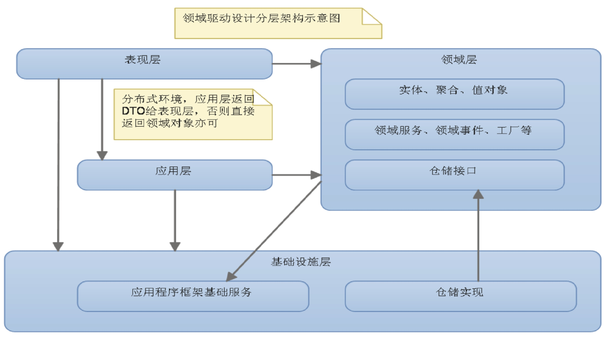
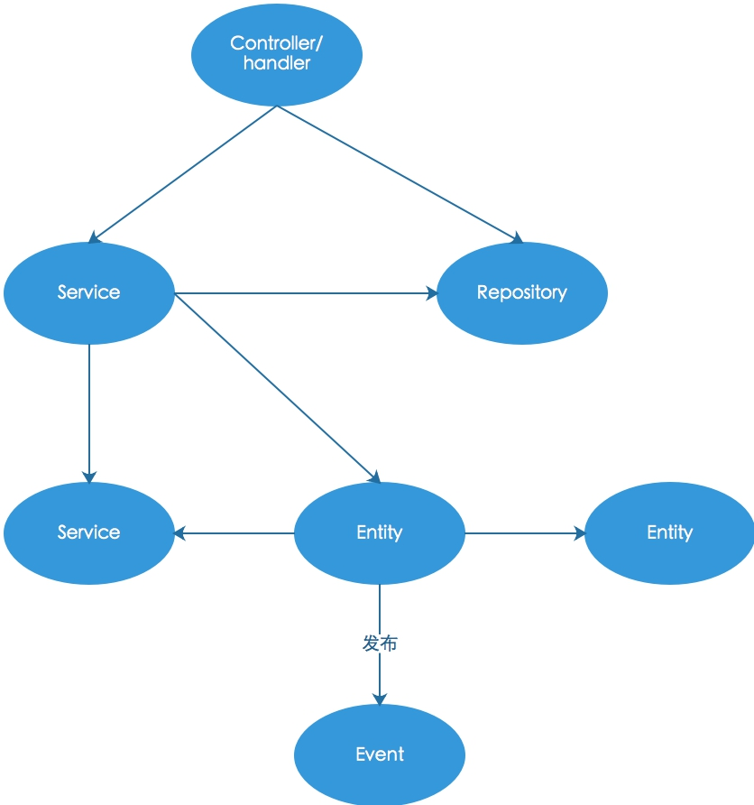

### 设计思想

- 借鉴于**领域驱动设计(DDD)**思想。有别于传统 MVC 分层设计，在 DDD 中，系统划分为四个层次：

  - **表示层**。展示UI/数据、接收用户的输入，直接和用户打交道（用户可能是人也可能是其他系统）。如前端交互。
  - **应用层**。从用户的维度定义系统需要完成的**任务**。应用层只定义任务，不负责具体实现。如这里的 Controller、Cron（实际上它们也承担了部分表示层职责）、Task、Subscriber等。
  - **领域层**。业务逻辑的具体实现。应用层调用领域层实现具体的任务。这里的 Domain目录下的代码。
  - **基础设施层**。提供诸如 DB、Cache、SESSION、Email、Log 等业务无关的基础支持。

  [领域驱动设计](https://www.jdon.com/ddd.html)

  [领域驱动设计分层模型](https://www.jianshu.com/p/c405aa19a049)

### 框架中的分层说明

- **表示层 + 应用层**：框架并没有对表示层和应用层做严格的划分，后面提到**应用层**也是指部分表示层+应用层。严格来说，表示层诸如 web（h5、json等）、web socket等客户端需要的数据格式以及提供的输入由表示层作转换处理，然后交由应用层，且多个表示层可以共用同一个应用层。我们的框架中路由+Controller 完成表示层+应用层的工作（不光如此，其他类型的 handle 如事件订阅者也兼顾表示层和应用层的工作）。框架处于复杂性考虑没有引入应用服务的概念，不过熟悉 DDD 的话根据实际需要可以自行引入。

  框架中的应用层：

  - Cron/：定时任务；
  - Http/: http api (路由、控制器)；
  - Subscribers/: 事件订阅者；
  - Tasks/: 异步任务；

  应用层应当尽可能简单，不能写业务逻辑（业务逻辑要写在 Domain 中），主要是用来定义用例维度的**任务**（如用户注册）。

- **领域层**。放在 Domain/ 目录中。这里放具体的业务逻辑代码，属于系统核心。Domain/ 底下可根据实际需要自由创建目录，自由组织代码。不过根据 DDD 通行做法，会分成以下几大概念：

  （以下仅作为概念阐述，不了解没关系）

  - Service（服务)。领域服务。Service 是用来组织其他实体类或其他 Service 实现业务逻辑的。外界（如 Controller）一般调用 Service 完成任务。Service 应当是**无状态的**（即 Service 不能在属性中保存业务状态信息）。

    另一个常见的 Service 是外部接口调用，如调用外部的积分系统，此时一般我们会创建一个单独的 Service 封装接口调用。

  - Entity（实体)。Entity 对应业务中的"那一个"东西，一般在数据库有对应一条记录。Entity 有唯一标识。

  - Value Object(值对象)。和 Entity 不同，Value Object 不区分"那一个"，Entity 通过标识辨识，而 Value Object 通过属性辨识。

  - Aggregation（聚合）。一个或多个 Entity 集聚成一个 Aggregation。外界跟 Aggregation 打交道，而不是直接跟每个 Entity 打交道。聚合有聚合根（Aggregation Root），它是一个 Entity。很多时候，一个 Entity 就是一个 Aggregation。

  - Domain Event（领域事件）。在领域对象中触发的事件。一般我们采用事件来接耦非主流业务，保持主流程的清晰简洁。

  - Repository（仓储）。实现 Entity 的存取。仓储是领域模型和数据存储（基础设施）之间的桥梁，它知晓领域类的细节以及数据存储的细节。一般地，在 Domain/ 中定义 Repository 接口，而在基础设施中定义实现，然后通过依赖注入来使用。仓储也应该是**无状态**的。

  - **领域层**简化版：

    不熟悉 DDD 甚至是面向对象设计的话，上面的概念会难以理解，实际操作中可以作如下简化：

    - Service（服务）。同上。服务主要起协调、组合功能的作用；
    - Entity（实体）。我们将上面的 Entity、Value Object、Aggregation 不做区分统一看作 实体。每个实体类都不大，负责的功能比较单一，多个实体组合/聚合完成一项完整的功能。总之，你可以把这里的实体看作类似之前的 Logic，不过是进行了职责划分的多个类的有机组合；
    - Domain Event（领域事件）。相当于钩子，采用的是观察者模式，实现复杂业务解耦；
    - Repository（仓储）。同上。

  - 注意：

    - 领域层的代码应当是可测试的（单元测试）；
    - 领域层对其他层的依赖应当通过依赖注入实现，而不能在领域层直接 new 其他层的对象；
    - 领域层和其他层通信一般是基于接口的（面向接口编程）；
    - **禁止在领域层直接使用 Session、Request、Response、Cookie、Header、Container、DI、Config 等全局变量和框架相关的东西**，保证业务逻辑代码是框架无关的而且是可测试的；

- **基础设施层**。提供诸如 DB、Cache、SESSION 等业务无关的基础支持。

### 调用关系图解

##### 说明

- 应用层的控制器/处理器调用领域层的 Service 处理任务；
- 应用层的控制器/处理器调用仓储 Repository 直接查询数据（针对那种不需要业务逻辑处理的数据展示，我们可以在控制器中直接调用仓储，返回需要的 DTO 对象，此乃**用例查询优化**）；
- Service 可以调用另一个 Service；
- Service 可以调用实体 Entity 来实现功能；
- Service 可以调用仓储获得 Entity；
- Service 可以发布领域事件；
- Entity 可以调用其它 Entity；
- Entity 可以调用 Service；
- Entity 可以发布事件供外围程序处理；

[返回](../README.md)